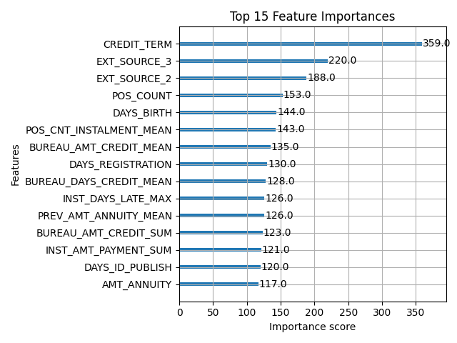

# Home Credit Default Risk Dashboard

This project takes a trained XGBoost credit-risk model, built on the Home Credit Default Risk dataset, and wraps it in an interactive Streamlit dashboard. Rather than treating deployment as a simple "load model, call predict" exercise, the goal here was to build something that respects how the underlying model actually works: a real applicant's risk score depends heavily on aggregated behavioral and bureau history that no one can meaningfully type into a form, alongside a smaller set of fields an applicant genuinely could declare on a loan application. The dashboard is built around that distinction.

**Live app:** [home-credit-default-risk-g9ynp2thzey3gf7jrqtkmq.streamlit.app](https://home-credit-default-risk-g9ynp2thzey3gf7jrqtkmq.streamlit.app/)

## How it works

The original model was trained on a merge of seven tables from the Home Credit dataset — the main application table plus bureau, previous applications, installment payments, credit card balances, and POS cash balances — aggregated up to one row per applicant and fed into an XGBoost classifier tuned with Optuna over 100 trials. That merge and training pipeline lives in `merge.py`, `data_pre.py`, and `train.py`, and only ever needs to run once, locally, to produce the saved `model.pkl` and `features.pkl`.

For the dashboard, that same merge and feature-engineering pipeline runs once more, this time over the Kaggle test set, and the result is cached to `test_merged.parquet` via `prep_test.py`. This was a deliberate performance decision: running the full seven-table merge live inside the app would mean reading and grouping tens of millions of rows on every cold start, which is both slow and a real risk of exceeding the memory limits of a free-tier deployment. Precomputing it once means the deployed app loads a single small file and responds in seconds rather than minutes.

The dashboard itself lets a user pick a real sampled applicant from that test set, then edit a handful of fields that a real applicant could plausibly declare — income, credit amount, annuity, goods price, family size, and days employed. Everything else — external bureau scores, previous loan history, payment behavior, regional metadata — stays fixed to that applicant's real recorded values, since those aren't things a person could self-report. When the user edits an income or credit field, the six derived ratio features the model depends on (credit-to-income ratio, annuity-to-income ratio, and so on) are recalculated live before the prediction runs, so the "what-if" exploration actually reflects the edited values rather than stale ones. That recomputation logic lives in `inference.py`, alongside the functions that load the cached model and data and run the final prediction.

## Design decision worth naming

An earlier version of this dashboard considered a fully manual form, where a user would type in every single feature the model uses, including the aggregated bureau and behavioral fields. That approach was deliberately rejected: those fields represent months or years of financial history that live in a credit bureau's systems, not in an applicant's head, and building sliders for them would have been misleading about how the model actually makes decisions. The hybrid approach used here — real sampled data as the base, with only genuinely declarable fields exposed as editable — was chosen specifically to stay honest about that boundary while still giving the dashboard real interactivity.

## Feature Importance

## Known limitations

A few things were identified during development and deliberately left as-is rather than fixed, since correcting them would require retraining the model and this project's scope was deployment, not further model iteration. Imputation statistics are recomputed per-dataset rather than reused from training, the dataset's well-known `DAYS_EMPLOYED` placeholder-value anomaly (365243) isn't explicitly handled, and `SK_ID_CURR` was inadvertently included as a real input feature during feature selection and is kept in the inference pipeline for train/inference consistency.

## Tech stack

Python, pandas, XGBoost, scikit-learn, Optuna (training only), Streamlit, PyArrow (for parquet caching). The trained model and feature list are serialized with `pickle`.

## Running locally

Install dependencies with `pip install -r requirements.txt`, then run `streamlit run src/app.py` from the project root. The app reads `model.pkl`, `features.pkl`, and `test_merged.parquet` from the `src/` directory using paths relative to the script location, so it runs the same way locally as it does when deployed.